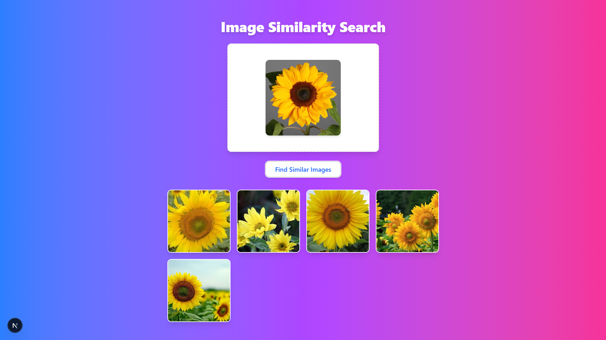

# Image Search App

This project is an image similarity search application built using FastAPI for the backend and React for the frontend. The backend uses the Inception-ResNet-v2 model for feature extraction and FAISS for efficient image similarity search.

## Features

- Upload an image to find similar images from a dataset.
- Uses deep learning-based feature extraction.
- Efficient nearest-neighbor search with FAISS.
- Simple and intuitive UI with drag-and-drop and paste support.

## Installation

### Backend Setup

1. Clone the repository:
   ```bash
   git clone https://github.com/yourusername/ImageSearchApp.git
   cd ImageSearchApp/backend
   ```
2. Install dependencies:
   ```bash
   pip install -r requirements.txt
   ```
3. Start the backend:
   ```bash
   python config.py
   ```

### Frontend Setup

1. Navigate to the frontend directory:
   ```bash
   cd ../frontend
   ```
2. Install dependencies:
   ```bash
   npm install
   ```
3. Start the frontend:
   ```bash
   npm run dev
   ```

## API Endpoints

- `GET /` - Check if the backend is running.
- `POST /search` - Upload an image and retrieve similar images.

## Screenshot




